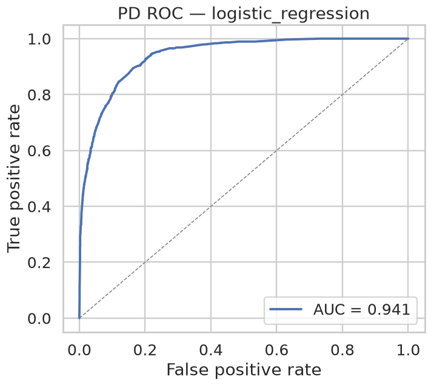
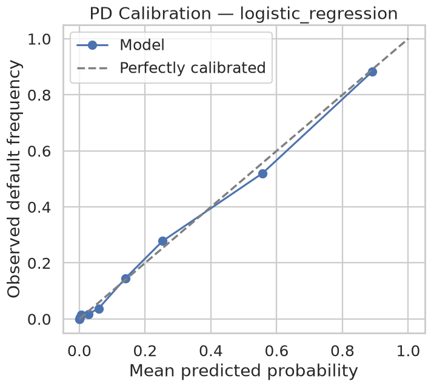
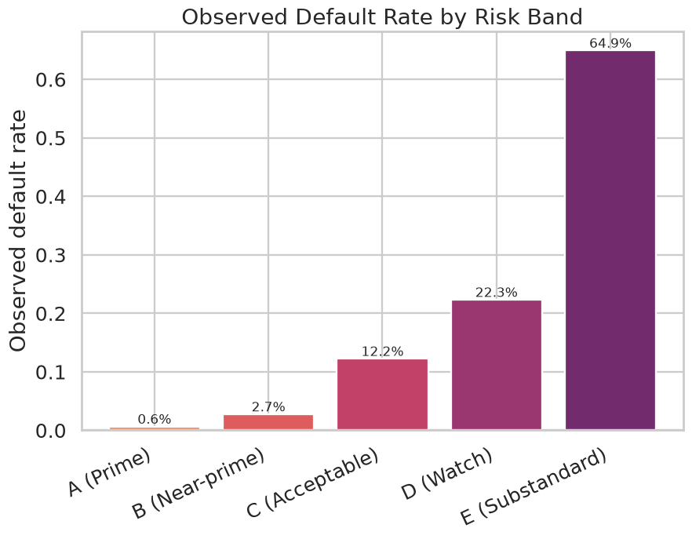
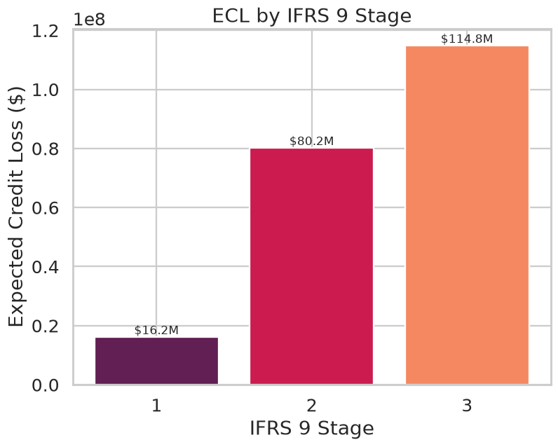
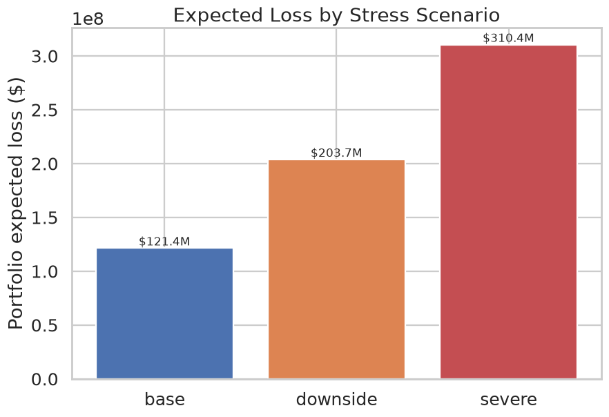
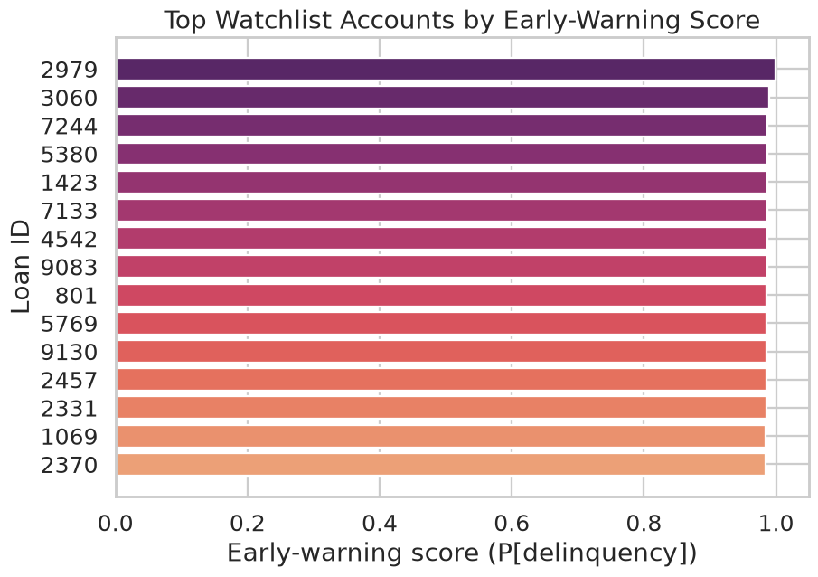

# Credit Risk Analytics Portfolio

**A production-style toolkit of five credit-risk models — PD, LGD, ECL, stress testing, and early-warning monitoring — built end-to-end in Python.** One command generates the data, trains every model, and produces the charts, metrics tables, and a written risk report.

> **Why this matters.** Lenders and credit-risk teams must answer three questions on every loan: *how likely is default (PD)?*, *how much would we lose if it defaults (LGD)?*, and *what does that cost us today (ECL)?* — then prove the book survives a downturn (stress testing) and catch trouble early (monitoring). This repo implements that full stack with IFRS 9 / CECL-style logic, calibrated probabilities, and interpretable outputs.

> ⚠️ **Demonstration portfolio.** All data is **synthetic**, generated from a transparent latent model with realistic assumptions. It is built to showcase modelling technique and is **not** real lending data or a production underwriting system.

---

## The five models

| # | Model | What it answers | Technique | Headline result* |
|---|-------|-----------------|-----------|------------------|
| 1 | **Probability of Default (PD)** | Will this loan default in 12 months? | Calibrated logistic regression vs. gradient boosting | **ROC-AUC 0.94**, monotonic risk bands |
| 2 | **Loss Given Default (LGD)** | If it defaults, how much do we lose? | Gradient-boosted regression + permutation importance | **MAE 0.077** on loss severity |
| 3 | **Expected Credit Loss (ECL)** | What loss do we book today? | PD × LGD × EAD, IFRS 9 staging, scenario-weighted | Loan- & portfolio-level ECL, 3-stage split |
| 4 | **Stress testing** | Does the book survive a downturn? | Base/downside/severe macro scenarios, HHI concentration | **Severe loss rate 18.3%** vs 7.2% base |
| 5 | **Early-warning system** | Which accounts to watch *now*? | Behavioural features → delinquency classifier + watchlist | **ROC-AUC 0.93**, 45% top-decile capture |

*\*Results from the default synthetic run (`n=12,000`). Reproducible with seed 42.*

---

## Business use cases

- **Loan pricing & approval** — PD score bands translate directly into approve/decline/price tiers.
- **IFRS 9 / CECL provisioning** — the ECL engine produces the probability-weighted allowance and 12-month vs. lifetime staging that accounting standards require.
- **Capital planning & CCAR-style stress** — scenario and sensitivity tables quantify loss under macro shocks (unemployment, rates, rent).
- **Portfolio management** — sector/geography concentration (HHI) flags where the book is over-exposed.
- **Loss mitigation / servicing** — the early-warning watchlist ranks accounts so collections can intervene before charge-off.

## Skills demonstrated

`Credit risk modelling` · `IFRS 9 / CECL ECL logic` · `PD calibration (isotonic)` · `ROC-AUC / PR-AUC / Brier` · `LGD regression & error segmentation` · `Macro stress scenarios & sensitivity analysis` · `Concentration risk (HHI)` · `Behavioural / early-warning modelling` · `scikit-learn pipelines` · `reproducible data engineering` · `pytest test suite` · `clear technical reporting`

---

## Employer-facing additions (risk analyst work samples)

Beyond the Python models, this repo includes three artefacts that mirror the
day-to-day deliverables of a **Risk Analyst / Credit Risk Analyst / Model Risk
Analyst**:

| Artefact | What it is | Skills it proves |
|----------|-----------|------------------|
| **[`sql/`](sql)** | 9 polished PostgreSQL/ANSI query files + schema over a credit data mart | Vintage analysis, delinquency **roll rates**, cohort default rates, **charge-off/loss curves**, utilisation trends, **exposure concentration (HHI)**, IFRS 9 **stage migration**, **watchlist extraction**, **ECL aggregation** — with window functions, CTEs, `GROUPING SETS`/`ROLLUP` |
| **[`docs/model_validation_report.md`](docs/model_validation_report.md)** | A full SR 11-7 / IFRS 9-style **PD model validation** | Conceptual soundness, discrimination, calibration/backtesting, **PSI**, sensitivity, challenger comparison, monitoring triggers, controls, findings log |
| **[`reports/risk_committee_memo.md`](reports/risk_committee_memo.md)** | An **executive credit risk committee memo** | Portfolio summary, ECL allowance, scenario/stress losses, watchlist, top risks, recommended actions — business-ready |

Each is written as a genuine work sample (findings, recommendations, monitoring
plans) rather than academic fluff, and every number ties back to the pipeline
output in `reports/model_summary.md`.

### Copy-ready resume bullets

- Built an end-to-end **credit-risk analytics toolkit** (PD, LGD, ECL, stress
  testing, early warning) in Python with a one-command reproducible pipeline;
  PD model **ROC-AUC 0.94** with isotonic calibration and monotonic risk bands.
- Implemented an **IFRS 9 / CECL ECL engine** (PD × LGD × EAD, 3-stage staging,
  probability-weighted macro scenarios) producing a **$211m allowance at 12.45%
  coverage** with stage/scenario reconciliation.
- Ran **macro stress tests** showing portfolio loss rising from **7.2% base to
  18.3% severe**, plus single-factor sensitivities and **HHI concentration**
  analysis by sector and region.
- Authored a **model validation report** (discrimination, calibration/backtesting,
  **PSI**, sensitivity, challenger benchmarking, monitoring triggers, controls)
  and an **executive risk committee memo** with recommended actions.
- Wrote **production-style SQL** for vintage analysis, delinquency **roll rates**,
  cohort default rates, **loss curves**, stage migration, and **watchlist
  extraction** using window functions and CTEs on a star-schema data mart.

---

## Selected results

**PD risk bands are monotonic and calibrated** — predicted PD tracks the observed default rate closely across every band:

| Band | Loans | Avg predicted PD | Observed default rate |
|------|------:|-----------------:|----------------------:|
| A (Prime) | 1,715 | 0.5% | 0.6% |
| B (Near-prime) | 437 | 4.7% | 2.7% |
| C (Acceptable) | 270 | 10.7% | 12.2% |
| D (Watch) | 363 | 20.3% | 22.3% |
| E (Substandard) | 815 | 66.9% | 64.9% |

**Stress scenarios** move portfolio loss from a 7.2% base loss rate to 18.3% under severe macro conditions.

**ECL by IFRS 9 stage** concentrates the allowance in Stage 2/3 (higher coverage ratios), exactly as the standard intends.

Charts (auto-generated into [`reports/figures/`](reports/figures)):

| PD ROC | PD Calibration | Score Bands |
|:---:|:---:|:---:|
|  |  |  |

| ECL by Stage | Stress Scenarios | Watchlist |
|:---:|:---:|:---:|
|  |  |  |

The full written summary lives in **[`reports/model_summary.md`](reports/model_summary.md)**.

---

## How to run

```bash
# 1. Install (Python 3.10+)
pip install -r requirements.txt

# 2. Run the entire pipeline: data -> 5 models -> charts + report
python run_pipeline.py

# faster smaller run / skip charts
python run_pipeline.py --n 3000
python run_pipeline.py --no-figures

# 3. Run the test suite
pytest
```

Runtime is a few seconds on a laptop. No API keys, credentials, or paid data sources — everything is self-contained.

## Project structure

```
credit-risk-analytics-portfolio/
├── run_pipeline.py            # one-command end-to-end pipeline
├── src/credit_risk/
│   ├── config.py              # all tunable assumptions (scenarios, staging, seed)
│   ├── data_generation.py     # synthetic portfolio + behavioural history
│   ├── pd_model.py            # Model 1 - Probability of Default
│   ├── lgd_model.py           # Model 2 - Loss Given Default
│   ├── ecl_engine.py          # Model 3 - Expected Credit Loss
│   ├── stress_testing.py      # Model 4 - macro stress + concentration
│   ├── early_warning.py       # Model 5 - delinquency early warning
│   ├── plotting.py            # figure helpers
│   └── report.py              # assembles model_summary.md
├── tests/                     # pytest: ECL formula, scenarios, schema, smoke
├── sql/                       # credit-analytics SQL (vintage, roll rates, ECL, ...)
│   ├── schema.sql             # data-mart DDL + seed
│   └── 01..09_*.sql           # one analysis per file + README
├── reports/
│   ├── figures/               # generated PNG charts (committed)
│   ├── model_summary.md       # generated written report (committed)
│   └── risk_committee_memo.md # executive risk committee memo (work sample)
├── data/processed/            # generated tables/metrics (gitignored)
├── docs/
│   ├── model_cards.md         # per-model assumptions, inputs, limitations
│   └── model_validation_report.md  # SR 11-7 / IFRS 9-style PD validation
├── requirements.txt · pyproject.toml · LICENSE
```

## Methodology notes

- **Calibrated PD.** Logistic regression is wrapped in isotonic calibration so predicted probabilities are usable as true default rates (not just rankings) — essential for ECL. Brier score is reported alongside AUC.
- **IFRS 9 / CECL staging.** Stage 1 uses a 12-month PD; Stage 2 (significant increase in credit risk) and Stage 3 (credit-impaired) use a lifetime PD derived via a constant-hazard survival transform. Stage 3 assumes PD = 1.
- **Scenario weighting.** ECL is the probability-weighted average of base (50%), downside (35%), and severe (15%) scenarios, each scaling PD and LGD by documented multipliers in `config.py`.
- **Interpretability.** LGD drivers are ranked by permutation importance (SHAP-style attribution without the heavy dependency), and every macro/staging assumption is centralised and auditable.

## Limitations & next steps

- Synthetic data means metrics reflect a *designed* signal, not real-world noise; on real data expect lower AUC and messier calibration.
- Lifetime PD uses a simplified constant-hazard transform rather than a full PD term-structure / vintage curve.
- Macro scenarios are illustrative planning assumptions, not econometric forecasts tied to a specific macro model.
- **Next:** swap in a public dataset (e.g., Fannie Mae / Freddie Mac loan performance or LendingClub) behind the same interface; add a PD term-structure; add SHAP and a monitoring dashboard. *(Model-governance artefacts — validation report with PSI/backtesting, and SQL for vintage/roll-rate/loss-curve analysis — are now included; see [Employer-facing additions](#employer-facing-additions-risk-analyst-work-samples).)*

## Author

Built by **James Witherington** as a demonstration of credit / risk analytics capability for Risk Analyst and Credit Risk Analyst roles. Feedback and questions welcome.

*License: MIT.*
