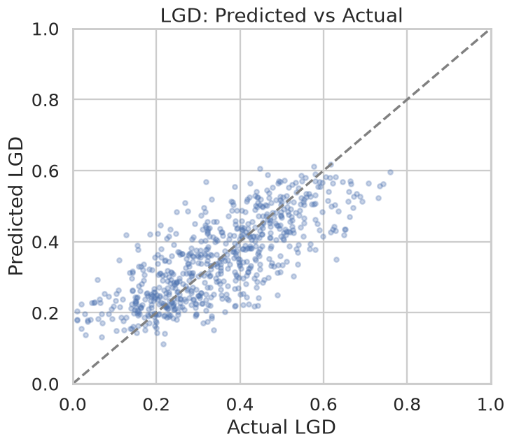
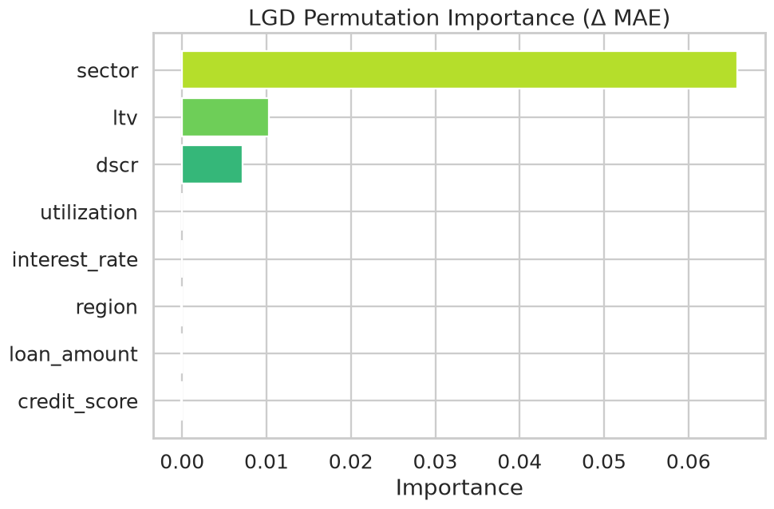
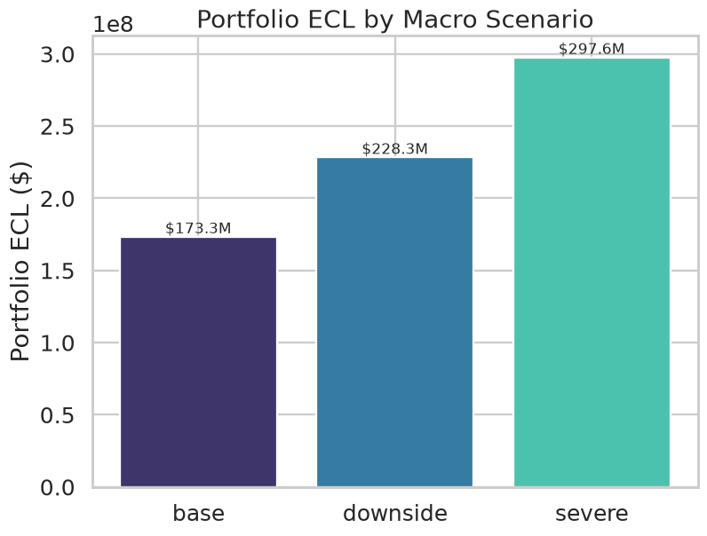
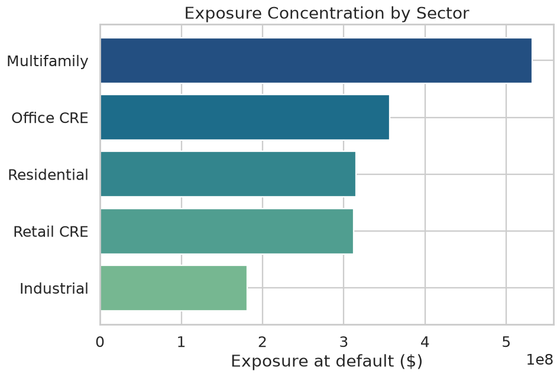
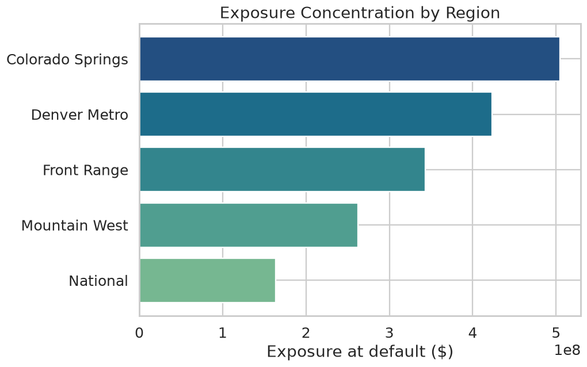

# Credit Risk Analytics — Model Summary

> **Synthetic data disclaimer.** All figures below are produced from a synthetic, reproducible portfolio generated for demonstration. They are *not* derived from real lending data and must not be used for production underwriting.

## Portfolio at a glance

- Loans modelled: **12,000**
- Total exposure at default (EAD): **$1,696,410,456**
- Probability-weighted ECL: **$211,167,801** (12.45% coverage ratio)
- IFRS 9 staging: Stage 1 **7,983** / Stage 2 **1,798** / Stage 3 **2,219**

## 1. Probability of Default (PD)

Best model by ROC-AUC: **logistic_regression**. Metrics on a held-out 30% test set:

| model               |   roc_auc |   pr_auc |   brier |
|:--------------------|----------:|---------:|--------:|
| logistic_regression |    0.9407 |   0.8022 |  0.0718 |
| gradient_boosting   |    0.9356 |   0.7917 |  0.0743 |

**Risk score bands** (observed default rate should rise monotonically):

| band            |   pd_low |   pd_high |   n_loans |   pct_of_book |   avg_predicted_pd |   actual_default_rate |
|:----------------|---------:|----------:|----------:|--------------:|-------------------:|----------------------:|
| A (Prime)       |     0    |      0.03 |      1715 |        0.4764 |             0.0051 |                0.0064 |
| B (Near-prime)  |     0.03 |      0.08 |       437 |        0.1214 |             0.0468 |                0.0275 |
| C (Acceptable)  |     0.08 |      0.15 |       270 |        0.075  |             0.1071 |                0.1222 |
| D (Watch)       |     0.15 |      0.3  |       363 |        0.1008 |             0.2032 |                0.2231 |
| E (Substandard) |     0.3  |      1    |       815 |        0.2264 |             0.6686 |                0.6491 |

## 2. Loss Given Default (LGD)

- Defaulted loans used: **2,219**
- MAE: **0.0771**, RMSE: **0.0972**, R²: **0.582**
- Mean actual LGD: **34.83%** vs predicted **35.08%**

**Segment-level error (by sector):**

| sector      |   n |   mean_actual_lgd |   mean_pred_lgd |    mae |
|:------------|----:|------------------:|----------------:|-------:|
| Industrial  |  89 |            0.3646 |          0.3876 | 0.0916 |
| Retail CRE  | 114 |            0.4561 |          0.4439 | 0.0799 |
| Multifamily | 118 |            0.3266 |          0.3275 | 0.078  |
| Office CRE  | 101 |            0.5162 |          0.5241 | 0.0773 |
| Residential | 244 |            0.2331 |          0.2334 | 0.07   |

**Top LGD drivers (permutation importance):**

| feature       |   importance |
|:--------------|-------------:|
| sector        |       0.0658 |
| ltv           |       0.0103 |
| dscr          |       0.0071 |
| utilization   |       0      |
| interest_rate |       0      |
| region        |      -0.0001 |

## 3. Expected Credit Loss (ECL) engine

ECL = PD × LGD × EAD × discount factor, computed per IFRS 9 stage and probability-weighted across macro scenarios.

**ECL by stage:**

|   stage |   n_loans |         ead |         ecl |   avg_pd |   avg_lgd |   coverage_ratio |
|--------:|----------:|------------:|------------:|---------:|----------:|-----------------:|
|       1 |      7983 | 1.11945e+09 | 1.6162e+07  |   0.0228 |    0.307  |           0.0144 |
|       2 |      1798 | 2.58409e+08 | 8.0193e+07  |   0.806  |    0.3383 |           0.3103 |
|       3 |      2219 | 3.18548e+08 | 1.14813e+08 |   1      |    0.3482 |           0.3604 |

**ECL by scenario (probability-weighted):**

| scenario   |   weight |         ecl |
|:-----------|---------:|------------:|
| base       |     0.5  | 1.73272e+08 |
| downside   |     0.35 | 2.28274e+08 |
| severe     |     0.15 | 2.97572e+08 |

## 4. Portfolio stress testing

**Scenario expected loss:**

| scenario   |   unemployment |   rate_shock_bps |   rent_shock_pct |   expected_loss |   loss_rate |   avg_stressed_pd |   avg_stressed_lgd |   loss_increase_vs_base |
|:-----------|---------------:|-----------------:|-----------------:|----------------:|------------:|------------------:|-------------------:|------------------------:|
| base       |              4 |                0 |             0    |     1.21372e+08 |      0.0715 |            0.1858 |             0.3193 |             0           |
| downside   |              7 |              150 |            -0.1  |     2.03707e+08 |      0.1201 |            0.2609 |             0.3832 |             8.23347e+07 |
| severe     |             10 |              300 |            -0.25 |     3.10422e+08 |      0.183  |            0.3309 |             0.463  |             1.8905e+08  |

**Single-factor sensitivity:**

| shock                            |   expected_loss |   delta_vs_base |   pct_change |
|:---------------------------------|----------------:|----------------:|-------------:|
| PD +25% & LGD +15% (rate shock)  |     1.65293e+08 |     4.39214e+07 |       0.3619 |
| LGD +30% (collateral/rent proxy) |     1.57784e+08 |     3.64116e+07 |       0.3    |
| PD +50% (unemployment proxy)     |     1.57754e+08 |     3.6382e+07  |       0.2998 |
| PD +25% (unemployment proxy)     |     1.43733e+08 |     2.23614e+07 |       0.1842 |
| LGD +15% (collateral/rent proxy) |     1.39578e+08 |     1.82058e+07 |       0.15   |

**Concentration:** sector HHI **0.222**, region HHI **0.225**. Largest sector: **Multifamily** (31.35% of exposure); largest region: **Colorado Springs** (29.74%).

## 5. Early-warning / delinquency model

- ROC-AUC: **0.931**, PR-AUC: **0.771**
- Event (delinquency) rate: **18.49%**
- Top-decile capture rate: **45.05%** of all delinquency events fall in the highest-risk 10% of the book

**Top 10 watchlist accounts:**

|   loan_id | sector      | region           |   ews_score |   expected_loss_at_risk |   current_dpd |   missed_payments_12m |
|----------:|:------------|:-----------------|------------:|------------------------:|--------------:|----------------------:|
|      2979 | Retail CRE  | Mountain West    |      0.9998 |                254437   |             4 |                     5 |
|      3060 | Residential | Colorado Springs |      0.99   |                 88890.7 |            15 |                    12 |
|      7244 | Office CRE  | Mountain West    |      0.9873 |                273462   |            19 |                    12 |
|      5380 | Office CRE  | Denver Metro     |      0.9871 |                132319   |            22 |                    12 |
|      1423 | Multifamily | National         |      0.987  |                121589   |            21 |                    12 |
|      7133 | Residential | Front Range      |      0.9864 |                 26784   |            11 |                    12 |
|      4542 | Residential | Denver Metro     |      0.9864 |                 51265.1 |            19 |                    12 |
|      9083 | Residential | Colorado Springs |      0.9863 |                 61783   |            14 |                    12 |
|       801 | Retail CRE  | National         |      0.986  |                121623   |            21 |                    12 |
|      5769 | Residential | Colorado Springs |      0.9858 |                 65166.8 |            17 |                    12 |

---

*Generated by `run_pipeline.py`. See `docs/model_cards.md` for assumptions and limitations of each model.*